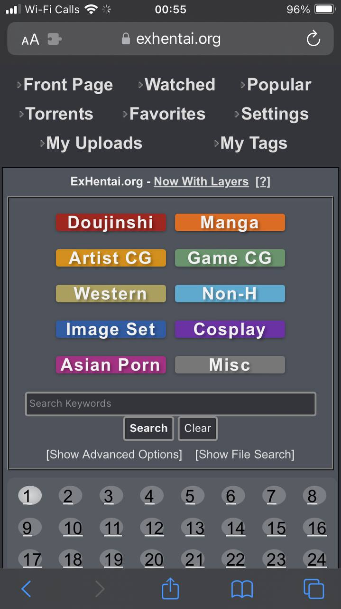
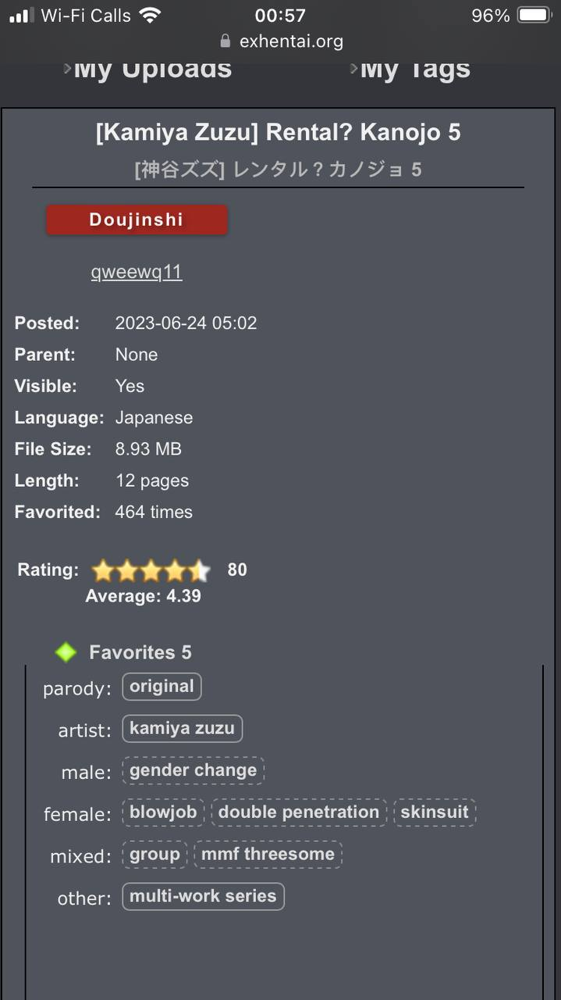
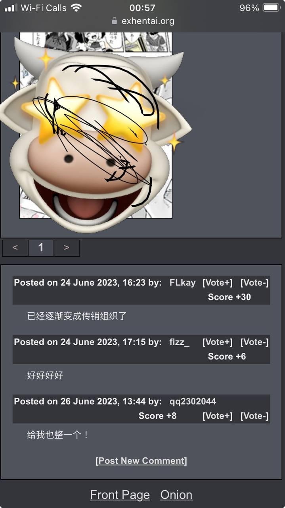

# BeMeS: A-Better-ExHentai-Mobo-Experience-Scripts
BeMeS is a userscript that give you a reasonable mobo experience.

## Pre-requirement
### ANdroid
For Android User, you can install [Kiwi Browser](https://play.google.com/store/apps/details?id=com.kiwibrowser.browser&hl=en&gl=US) then open kiwi browser, install [Tampermonkey](https://chrome.google.com/webstore/detail/tampermonkey/dhdgffkkebhmkfjojejmpbldmpobfkfo) to install userscript.

### iOS
For iphone user, please upgrade iOS 16, then your safari allow you load extendsions. Then install [HyperWeb](https://apps.apple.com/us/app/hyperweb/id1581824571) OR [UserScripts](https://github.com/quoid/userscripts), then follow guideline to config it.

## Install 
COPY URL [	https://github.com/lenchan139/A-Better-ExHentai-Mobo-Experience-Scripts/raw/master/exhentai-mobo.user.js](	https://github.com/lenchan139/A-Better-ExHentai-Mobo-Experience-Scripts/raw/master/exhentai-mobo.user.js) then add it to your userscript manager. If you use iOS UserScripts App, it recomend point to icloud folder that you can upload and sync all userscript cross devices.

## Screenshots
.jpg)

.jpg)

.jpg)
